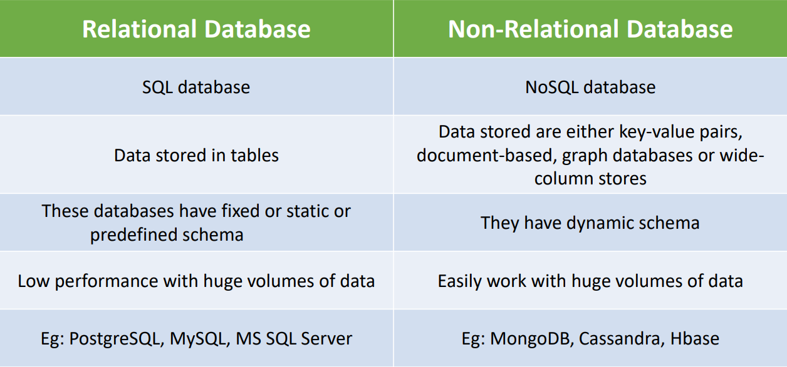

# SQL(Structured Query Language)

### <mark style="color:red;">What is SQL?</mark>

SQL (Structured Query Language) is a programming language used to interact with database

RDBMS is the basis for SQL i.e. SQL stores data in RDBMS

### <mark style="color:red;">RDBMS</mark>

RDBMS stands for Relational Database Management System.

The data in RDBMS is stored in database objects called tables.&#x20;

A table is a collection of related data entries and it consists of columns and rows.

### <mark style="color:red;">Some of The Most Important SQL Commands</mark>

* `SELECT` - extracts data from a database
* `UPDATE` - updates data in a database
* `DELETE` - deletes data from a database
* `INSERT INTO` - inserts new data into a database
* `CREATE DATABASE` - creates a new database
* `ALTER DATABASE` - modifies a database
* `CREATE TABLE` - creates a new table
* `ALTER TABLE` - modifies a table
* `DROP TABLE` - deletes a table
* `CREATE INDEX` - creates an index (search key)
* `DROP INDEX` - deletes an index

### <mark style="color:red;">SQL Application</mark>

CRUD is an acronym for CREATE, READ(SELECT), UPDATE, and DELETE statements in SQL

### <mark style="color:red;">SQL v/s NoSQL</mark>

<figure><figcaption></figcaption></figure>

### <mark style="color:red;">SQL Commands</mark>

There are mainly **3 types** of SQL commands:&#x20;

• **DDL** (**Data Definition Language**): create, alter, and drop&#x20;

• **DML** (**Data Manipulation Language**): select, insert, update, and delete&#x20;

• **DCL** (**Data Control Language**): grant and revoke permission to users

### <mark style="color:red;">What is a Database?</mark>

The database is a system that allows users to store and organize data

### <mark style="color:red;">Excel v/s Database</mark>

<figure><figcaption></figcaption></figure>

